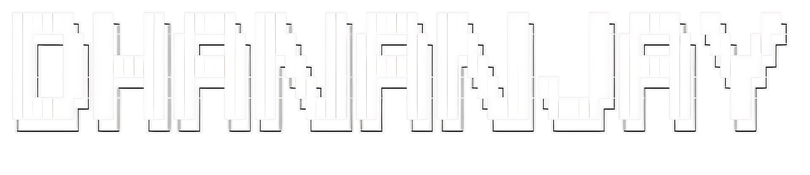

<p align="center">
  
</p>

<p align="center">
<a href="https://git.io/typing-svg"></a>
</p>


## > whoami
```json
Info = {
    "name"      : "Dhananjay Dev",
    "status"    : "Running of coffee and questionable Decisions",
    "interests" : [
        "Video games",
        "Movies",
        "Tech",
        "and building software god knows who'll use "
    ],
    "currently" : "Working on SkipHostelWifi, a GOATED wifi connection assistant for my college"
}
```
## > contact --via

<p align="center">

[](https://www.linkedin.com/in/dhananjay-dev-204b72292/)
[](mailto:dhananjaydev2018@gmail.com)
[](https://www.instagram.com/__.dhananjayyyy.__/)
[](https://x.com/Dhananjaydev_3)

*"Still figuring out if I'm building the future or just breaking things stylishly."*

</p>                                                      
